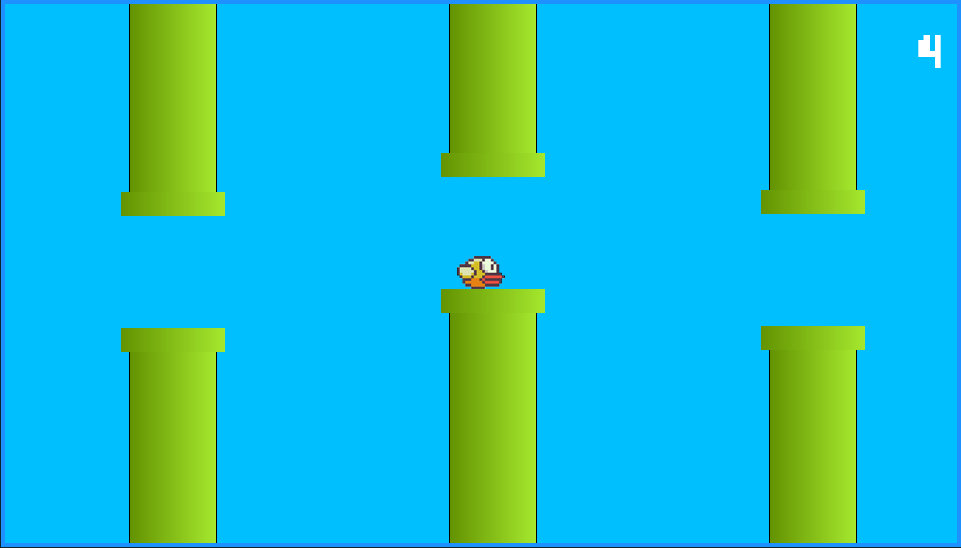

# GAME FLAPPY BIRD

Projeto desenvolvido pelo curso Web Modermo Completo. Cursado pela plataforma Udemy, onde abordou-se o primeiro projeto, a criação de uma <b>Game Flappy Bird</b> em javaScript.

[:link: Clique aqui para acessar](https://ueveton.github.io/CalculadoraJS/)

## 🛠 Tecnologias

- HTML
- CSS
- JAVASCRIPT

## 📲 CONTATO

uevetonsp89@gmail.com

